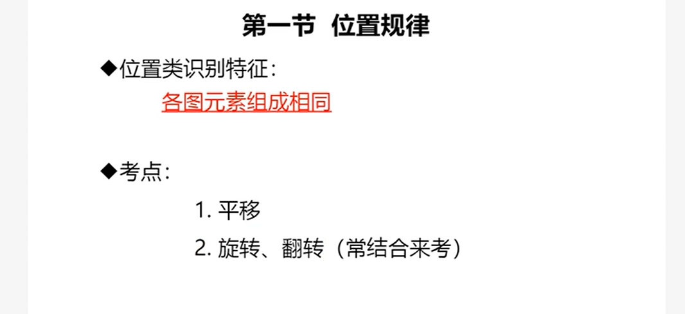

-----

# 判断推理

## 一、图形推理

### 1、命题形式

>    
>
> ---
>
> 

### 2、图形规律

> 

### 3、位置规律（元素组成相同）

> 

#### 3.1平移

> 
>
> ---
>
> > **宫格型黑块平移**
>
> 
>
> ---
>
> 
>
> ---
>
> 
>
> ---
>
> > **多宫格方向判定**
>
> 
>
> ---
>
> 
>
> ---
>
> > **技巧**
>
> 

#### 3.2旋转

> 
>
> ---
>
> 

#### 3.3翻转

> 
>
> > **对称和翻转区别**
>
> 
>
> > **区分旋转和翻转**
>
> 
>
> ---
>
> 

#### 3.4小结

> 

### 4、样式规律（元素组成相似）

> 

> 

#### 4.1遍历

> 
>
> ---
>
> 

#### 4.2加减同异

> 
>
> ---
>
> 
>
> ---
>
> 
>
> ---
>
> 

#### 4.3黑白运算

> 

#### 4.4小结

> 

### 5、属性规律（元素组成不相同、不相似）

> 

> 

#### 5.1对称性

> 
>
> ---
>
> 
>
> > **对称性的方向和数量**
>
> 
>
> > **对称轴的位置关系**
>
> 
>
> ---
>
> 
>
> > **一个图里面两个小图形都有对称轴**
>
> 
>
> ---
>
> 
>
> ---
>
> 
>
> > **常见轴对称和中心对称图形**
>
> 
>
> ---
>
> 

#### 5.2曲直性

> 
>
> ---
>
> 

#### 5.3开闭性

> 
>
> ---
>
> 

#### 5.4小结

> 

### 6、特殊规律

> 

#### 6.1图形间关系

> 
>
> ---
>
> 
>
> ---
>
> 

#### 6.2功能元素

> 
>
> ---
>
> 
>
> ---
>
> 
>
> ---
>
> 

#### 6.3小结

## 二、定义判断

## 三、类比推理

## 四、逻辑判断

